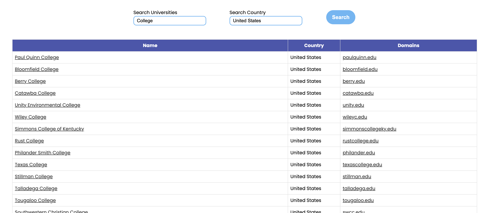

</img>

# World University Search Engine

This project is a simple search engine for localizing universities. It was build using [ReactJS](https://reactjs.org) and consumes [this API](https://github.com/Hipo/university-domains-list#university-domains-and-names-data-list--api).

## 📦 Installation

### Requirements

Before you start to code, you'll need to have installed the following features: [Git](https://git-scm.com), and [Node](https://nodejs.org).

### Install

1. Clone the repository `git clone git@github.com:lmiguelcolombo/university-data-list.git`
2. Install dependencies with npm or yarn (`npm install`, `yarn`)
3. Run the application using `npm run start` or `yarn start`.
4. Open your browser and go to [http://localhost:8080](http://localhost:3000)
